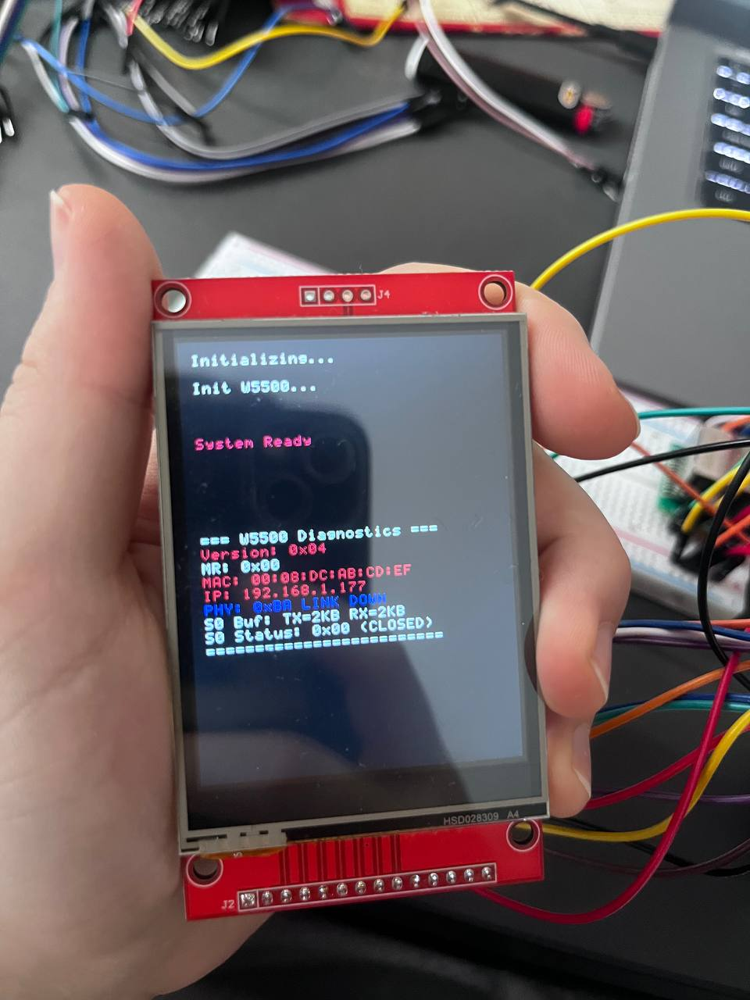

# Практична робота Ethernet

**Пристрій:** STM32F411 Black Pill  (Пізніше -- STM32F411E-Disco)
**Транспорт:** Ethernet (W5500 SPI)  
**Протокол:** HTTP/JSON  
**Оновлення:** 1 Hz без миготіння

---

## Підключення обладнання (Pin Mapping)

### W5500 Ethernet Module (SPI2)
| W5500 Pin | STM32 Pin | Опис |
|-----------|-----------|------|
| MOSI | PB15 | SPI2 MOSI |
| MISO | PB14 | SPI2 MISO |
| SCK | PB13 | SPI2 SCK |
| CS | PB12 | Chip Select |
| RST | PB11 | Reset |
| INT | PB10 | Interrupt (опційно) |
| 3.3V | 3.3V | Живлення |
| GND | GND | Земля |

### ILI9341 Display (SPI1)
| ILI9341 Pin | STM32 Pin |
|-------------|-----------|
| MOSI | PA7 |
| SCK | PA5 |
| CS | PA4 |
| DC | PA3 |
| RST | PA2 |

### I²C Sensor (I2C1)
| Сенсор | Адреса | Pins |
|--------|--------|------|
| BME280 | 0x76 | PB6 (SCL), PB7 (SDA) |

### GPS Module
| GPS Pin | STM32 Pin |
|---------|-----------|
| TX | PA10 (USART1_RX) |
| RX | PA9 (USART1_TX) |

### CLI Debug (USART2)
| Pin | STM32 Pin |
|-----|-----------|
| TX | PA2 (USART2_TX) |
| RX | PA3 (USART2_RX) |

---

## Мережеві параметри

### Режими роботи

**1. DHCP (За замовчуванням)**
- Автоматичне отримання IP від DHCP-сервера
- Timeout: 30 секунд
- При невдачі → перехід на статичний режим

**2. Static IP (Fallback)**
- IP: `192.168.1.177`
- Subnet: `255.255.255.0`
- Gateway: `192.168.1.1`
- DNS: `8.8.8.8`

### Перевірка підключення

```bash
# 1. Ping test
ping 192.168.1.177

# 2. HTTP test
curl http://192.168.1.177/status

# 3. Відкрить в браузері
http://192.168.1.177/
```

---

## Тестування w5500

Розробили фукнції тестування підключення (відкриття socket, тд.), які теж виводили на екран і могли відслідковувати роботу мережі.



Функції є частиною main.c


### Відео з демонстрацією роботи основного завдання:

https://drive.google.com/file/d/1Kl5WMtwf7H1Yn9W5Zftcp3ezisavrfD7/view?usp=sharing

--- 

## Додаткові завдання:

Переробили проект з STM32 Black Pill на STM32F411E-Disco

SPI1 (Display):
- PA5 → ILI9341 SCK
- PA6 → ILI9341 MISO
- PA7 → ILI9341 MOSI
- PE7 → ILI9341 CS
- PE8 → ILI9341 DC
- PE9 → ILI9341 RST
- PE10 → ILI9341 BL

SPI2 (W5500):
- PB13 → W5500 SCK
- PB14 → W5500 MISO
- PB15 → W5500 MOSI
- PE3 → W5500 CS
- PE2 → W5500 RST
- PE4 → W5500 INT

I2C1 (BME280):
- PB6 → BME280 SCL
- PB7 → BME280 SDA

USART1 (GPS):
- PA9 → GPS RX
- PA10 → GPS TX

Power + Ground:
- 3.3V and GND to all modules

*mDNS (Bonjour services)*

1. Завантажили Bonjour Services
2. Написали mdns.c/h з реалізацією
3. Викликали в main.c

Тестування:

```bash
Відкрить в браузері
http://stm32f411panel.local
```

### Результат - ping не проходить. Веб-сторінка не завантажується. Хоча ми розібрались з будовою і головною ідеєю.
Витрачено: 7 людино-годин.

